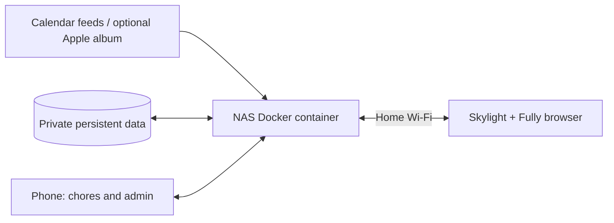

# Skylight Family Hub

Repurpose a compatible Skylight Calendar as a touch display for a self-hosted family calendar, chores, points, rewards, and photos.

**Run the server on a NAS with Docker or an always-on Raspberry Pi.** The Skylight loads it over your home network. A laptop is useful for initial setup, but does not need to stay connected once the server runs elsewhere. Apple hardware is not required.

This is a community adaptation of [Home Screens](https://github.com/home-screens/home-screens), licensed under MIT. It is not affiliated with Skylight or Apple and does not unlock Skylight subscription features. It runs separate software while retaining the original Skylight app.

## What it does

- **Calendar:** week/month toggle, previous/next, Today, and event details. Events are read-only; edit them on your phone.
- **Chores:** tap a person, then tap a chore. Tap again to undo. Each person sees their own checklist, progress, and points.
- **Rewards:** selected person's point balance and configurable reward costs.
- **Schedules:** daily/weekly chores and every-N-days recurrence.
- **Photos:** local uploads or an Apple Shared Album website, with periodic refresh and newest-photo priority.
- **Startup:** a small optional Android helper opens Fully Kiosk Browser after boot.

No subscription to this project is required. Your NAS, electricity, network, and any optional third-party services remain your responsibility.

## Architecture



Skylight needs **wall power and Wi-Fi**. USB to a computer is only needed for setup/debugging. The NAS must stay powered on. Internet is needed to refresh external calendars and photos; chore records live on the NAS. This is not an offline-first app and does not run its server on the Skylight itself.

## Step-by-step setup

1. **Start the server:** follow [NAS / Docker setup](docs/NAS-DOCKER.md). Use an empty persistent data directory for a new installation.
2. **Secure and configure it:** follow [Family setup](docs/FAMILY-SETUP.md). Set a parent password before adding calendar links or photos.
3. **Prepare the Skylight:** follow [150-CAL device setup](docs/DEVICE-SETUP.md). Firmware matters; the Android settings workaround is not guaranteed on every device.
4. **Point Fully at your private display URL.** Reserve the NAS address in your router so it stays stable.
5. **Test without the laptop:** unplug USB, close the laptop, complete and undo a sample chore, browse calendar dates, then reboot Skylight. Confirm it returns to the NAS display.

Already running on a Mac? Use the [migration section](docs/NAS-DOCKER.md#migrate-the-existing-installation) before creating new family data. Copy the complete private data directory, not only chore definitions.

## Tested hardware and limits

- Skylight **150-CAL**, 15-inch, Rockchip RK3562, Android 13, stock WebView 109.
- Week/month controls, person-based checklists, reward selection, calendar feeds, and Apple album rendering verified on the physical display.
- Delayed Android boot helper verified after a normal reboot.
- USB debugging was enabled through an Android System UI crash-dialog workaround. No root, firmware flashing, factory reset, or replacement of the default Home app was needed.
- Container and NAS validation status is recorded in [Validation](docs/VALIDATION.md). A working Mac deployment does not by itself prove every NAS platform.

Original Skylight software stays installed. See device instructions for returning to it and removing the helper.

## Local development

Use Node.js 24 with npm 11, or another compatible Node version matching `package.json`.

```bash
git clone https://github.com/Biblejustin/skylight-family-hub.git
cd skylight-family-hub
npm ci
npm run setup
npm run dev -- --hostname 127.0.0.1
```

Open `http://localhost:3000/editor`. The setup command creates three empty screens; it never overwrites an existing `data/config.json`. No family names, tasks, credentials, calendar links, or photos are included.

```bash
npm test
npm run lint
npx tsc --noEmit
npm run build
```

For normal NAS operation use Docker, not the development server. Update this fork by pulling its source and rebuilding the image. Do not use the upstream Pi installer, prebuilt images, or in-app upgrade flow: they target upstream Home Screens and can remove this fork's additions.

## Privacy and backups

`data/` contains calendar credentials, password hashes, display tokens, chores, completions, balances, and other private state. Uploaded media lives in `public/backgrounds/`. Both belong in private persistent storage and private backups, never in Git.

The display URL is a credential. Authenticated display sessions can read configuration including calendar feed URLs. Parent authentication protects administrative changes, but the display's chore/reward flows are designed for family use rather than strong per-child authentication.

Apple Shared Album integration requires its **Public Website** link. Anyone with that link can view the album. This project does not implement private Apple account photo synchronization. Local uploads avoid that public link but do not automatically follow a private Apple album.

Read [Security and publication notes](SECURITY.md) before exposing a deployment beyond your home network. The provided deployment is intended for a trusted LAN.

## Credits

- [Home Screens](https://github.com/home-screens/home-screens) by Bryan Brandau and contributors: application foundation. Original MIT copyright retained in [LICENSE](LICENSE).
- [SkylightMaxCalendarADB](https://github.com/dinewby88/SkylightMaxCalendarADB): prior documentation of the System UI / App info route, adapted and verified on one 150-CAL.
- [Fully Kiosk Browser](https://www.fully-kiosk.com/): separately installed Android browser. Its APK is not redistributed here.

See [Provenance](docs/PROVENANCE.md) for the source baseline and changes.
